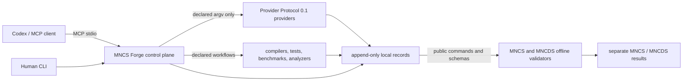

# MNCS Forge MCP

MNCS Forge is an experimental, non-normative Model Context Protocol server and CLI that gives
Codex an MNCS-native development and evidence control plane. It makes project authority,
candidate lineage, epochs, declared checks, evidence gaps, selection, freeze, and evaluator-mode
boundaries explicit.

Forge is **not** required for MNCS conformance, an accredited certification system, a source of
independence or protected custody, or another universal Code Property Graph system. It does not
replace Joern. Joern, compilers, analyzers, benchmarks, mutation systems, sanitizers, and runtime
harnesses remain replaceable evidence providers.

Version `0.1.0a1` is a reference experiment. Local results do not promote MNCS, MNCDS, RFCs, or
case studies. `REVIEW_REQUIRED` is a workflow disposition, not an MNCS result. Status aggregation
is `FAIL > UNKNOWN > PASS`; absent or unsupported evidence never silently becomes `PASS`.

## Architecture



MCP is the interactive Codex interface. Provider Protocol 0.1 is the deterministic analyzer
interface. MNCS and MNCDS validators remain offline result authorities. Forge never copies their
conformance logic into its control plane.

## Quick start

```bash
python3 -m venv .venv
. .venv/bin/activate
python -m pip install -e '.[dev]'
mncs-forge --config examples/minimal/mncs-forge.toml config validate
mncs-forge --config examples/minimal/mncs-forge.toml inspect
```

For an MNCS checkout containing the committed EdgeStream integration configuration:

```bash
./scripts/install-codex-mcp.sh \
  /absolute/path/to/machine-native-complexity-standard/mncs-forge.toml
./scripts/verify-codex-mcp.sh \
  /absolute/path/to/machine-native-complexity-standard/mncs-forge.toml
```

Start a new Codex session after registration; an already-running process is not assumed to reload
MCP servers dynamically. Uninstall with `./scripts/uninstall-codex-mcp.sh`.

## Interfaces

The `mncs-forge` CLI provides `doctor`, `inspect`, `status`, `blockers`, `epoch begin`,
`candidate register/compare/select/reject`, `check development`, `explain`, `freeze`, `evaluate`,
`reconcile`, `bundle`, `ledger verify`, and `config validate`.

The `mncs-forge-mcp` stdio server exposes project inspection, separate claim status and blockers,
epoch/candidate control, declared checks, compact failure explanation, policy-bound comparison and
disposition, freeze/final evaluation, reconciliation, and bundle orchestration. Read-only
resources summarize authority, active state, evidence, blockers, and usage. Prompts guide the
controlled workflow but cannot bypass tool authority checks.

## Documentation

- [Architecture and trust boundaries](docs/architecture.md)
- [Configuration](docs/configuration.md)
- [Security model and residual risks](docs/security.md)
- [CLI and MCP surface](docs/interfaces.md)
- [Codex installation](docs/codex-cli.md)
- [EdgeStream integration](docs/edgestream.md)
- [Provider Protocol integration](docs/provider-protocol.md)
- [Evidence and identity model](docs/evidence-model.md)
- [Compatibility](docs/compatibility.md)

Licensed under Apache-2.0.
