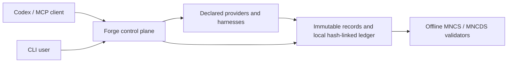

# MNCS Forge MCP

MNCS Forge is an experimental, non-normative Model Context Protocol server and CLI for
machine-native development and evidence control. It makes project authority, candidate lineage,
declared checks, provider capabilities, evidence gaps, selection, freeze, and evaluator-mode
boundaries explicit.

> Forge is not required for MNCS conformance, an accredited certification system, a source of
> independent evaluation or protected custody, or a universal program analyzer.

Version `0.1.0a2` is a reference experiment. Local results do not promote MNCS, MNCDS, RFCs, or
case studies. Status aggregation is `FAIL > UNKNOWN > PASS`; absent, stale, unsupported, or
unavailable evidence remains `UNKNOWN`.

## What Forge does

- exposes one project-scoped control plane through a CLI and local stdio MCP server;
- runs only declared argument-array workflows and Provider Protocol capabilities;
- records epochs, candidates, actions, results, selection, freeze, and evaluation lineage;
- keeps development and evaluator-mode authority separate;
- provides bounded machine-native micro-verifier discovery and execution; and
- delegates normative MNCS and MNCDS decisions to the public offline validators.



Forge is orchestration, not analysis. Joern is an optional legacy provider rather than a default
dependency. Compilers, analyzers, benchmarks, mutation systems, sanitizers, and runtime harnesses
remain replaceable providers.

## Quick start

```bash
python3 -m venv .venv
. .venv/bin/activate
python -m pip install -e '.[dev]'
mncs-forge --config examples/minimal/mncs-forge.toml config validate
mncs-forge --config examples/minimal/mncs-forge.toml inspect
```

See [Getting started](docs/getting-started.md) for installation, CLI, MCP registration, and the
minimal controlled workflow.

## Documentation

- [Documentation map](docs/README.md)
- [Architecture and trust boundaries](docs/architecture.md)
- [Security model and residual risks](docs/security.md)
- [Forge Cell execution assurance](docs/forge-cell.md)
- [Configuration](docs/configuration.md)
- [CLI and MCP interfaces](docs/interfaces.md)
- [Canonical operation registry](docs/operation-registry.md)
- [Provider Protocol integration](docs/provider-protocol.md)
- [Machine-native micro-verifiers](docs/micro-verifiers.md)
- [Query-driven micro-debugging](docs/micro-debugging.md)
- [Compiler evolution observations](docs/compiler-evolution.md)
- [Evidence and identity model](docs/evidence-model.md)
- [Lifecycle state machine](docs/lifecycle.md)
- [Transactional local storage](docs/storage.md)
- [Development roadmap](ROADMAP.md)
- [Codex implementation queue](docs/codex-next-steps.md)
- [Forge Cell Codex queue](docs/codex-forge-cell-next-steps.md)
- [Micro-debugging Codex queue](docs/codex-micro-debugging-next-steps.md)

## Current development priority

The next release should stabilize the internal architecture before adding more verifier types or
additional sandbox backends. Distributed execution should consume `mncs-fabric` rather than a second
Forge fleet. The verifier lifecycle now has one explicit service, and persistent evidence now crosses a
frozen typed, versioned boundary with deterministic legacy migration. Explicit state transitions
derive from append-only typed history, authorized record-plus-ledger changes commit through one
recoverable local transaction boundary, and the compatibility facade delegates to explicit services
through typed storage, execution, and identity ports. CLI and MCP dispatch now share one typed
operation registry and deterministic interface inventory. Declared workflow and verifier-provider
execution both persist identity-bound receipt bindings that reference the experimental MNCS
execution-receipt envelope without claiming sandbox, independence, or custody.

Forge now includes a sandbox-capable rootless Podman runner (ADR 0016) selected through an optional
`[runner]` configuration section. It enforces network isolation, a read-only root filesystem and
workspace mount, declared writable mounts, and digest-resolved image identity; availability probes
fail closed rather than downgrading assurance claims. Execution assurance is a first-class typed
record (ADR 0017): `execution.assurance.assess` evaluates receipt bindings against requested
properties fail-closed so a functional `PASS` can never imply isolation or custody, and Forge Cell
document validation is available read-only through the shared registry. Compiler-candidate
validation evidence is now bound to exact artifact identities; substituted or copied validation
cannot promote a candidate.

Remaining work for the stable local Forge milestone: an adversarial study of the Podman runner
path, challenge-bound assessment freshness, and Fabric-backed replication seams. Query-driven
micro-debugging retains its architecture, versioned reference vocabulary, and separate
implementation queue; runtime sessions remain future work.

Compiler experiment persistence accepts both the original language compilation-study record and the
new language-owned bounded experiment result. Forge can compare realization requests, backend and
typed artifact identities, and copied validator observations while leaving experiment status,
semantic legality, assurance, and conformance under their declared owners.

Licensed under Apache-2.0.
