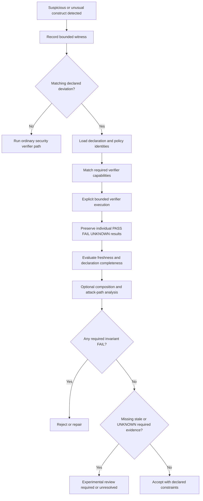

# Intent-aware security verification

> Proposed Forge architecture. This document does not implement the capability, change MNCS or
> MNCDS conformance, create certification, or establish independent evaluation.

Forge should help an agent produce code that is not only functional but structurally harder to
misuse. At the same time, MNCS-oriented development is expected to explore useful compiler-aware and
less orthodox implementation strategies. A conventional scanner cannot be allowed to flatten every
unfamiliar construct back into ordinary code merely because unfamiliarity correlates with risk.

The intended model is:

> **Flag the unusual, verify the semantics, preserve the intent, and reject the construct when the
> evidence fails.**

The related standards-side proposal is tracked in
[MNCS PR #57](https://github.com/epi13/machine-native-complexity-standard/pull/57). Forge is where
much of the development-time routing, evidence capture, freshness, and repair workflow would occur.

## Core distinctions

Forge must keep the following facts separate.

### Suspicion

A tool recognized a pattern associated with risk, unusual control flow, an unsafe primitive, an
uncommon compiler technique, or a departure from project convention.

Suspicion is a routing signal. It is not by itself a verifier failure.

### Invariant result

A bounded verifier evaluated a declared property and returned `PASS`, `FAIL`, or `UNKNOWN` under its
stated scope, assumptions, inputs, provider, environment, and dependency envelope.

A confirmed `FAIL` remains a failure even when no current exploit chain is known.

### Intent

A developer or agent declared why the construct exists, what benefit it is expected to provide, the
semantic envelope in which it is permitted, and which invariants must hold.

Intent explains unusual code. It does not override failed evidence.

### Reachability and composition

A bounded analysis evaluated whether attacker-controlled influence, a privilege boundary, another
weakness, or deployment context can connect the local finding into an attack path.

Composition affects severity, urgency, and workflow disposition. It does not rewrite the local
verifier result.

### Workflow disposition

Project policy decided whether the current candidate may proceed, requires repair, requires review,
remains experimental, or is stale.

A disposition is not a fourth verification status and is not MNCS/MNCDS conformance.

## Governing principles

1. **Orthodoxy is a heuristic; invariants are authoritative.**
2. **A suspicious pattern requests evidence rather than automatic rejection.**
3. **A genuine weakness should normally be repaired even without a coherent attack chain.**
4. **Exploitability determines priority; invariant violation determines whether the weakness is
   real.**
5. **Intent cannot waive memory, authorization, confidentiality, integrity, isolation, or other
   required safety properties.**
6. **Exceptions are semantic and identity-bound, never broad syntax whitelists.**
7. **Missing or unsupported evidence remains `UNKNOWN`.**
8. **Development evidence may guide repair; evaluator evidence remains subject to freeze,
   disclosure, custody, and non-feedback rules.**
9. **Recursive learning preserves the complete verified pattern, not merely the unusual syntax.**

## Three-layer verifier model

Security-oriented micro-verifiers should be grouped by the property they evaluate rather than by a
particular scanner brand.

### Layer 1: local invariants

Examples include:

- bounds and index validity;
- lifetime and ownership safety;
- allocation-size arithmetic;
- integer conversion and wraparound semantics;
- parser state and input-length constraints;
- resource release and exhaustion limits;
- initialized state;
- aliasing and alignment assumptions;
- concurrency and race properties;
- language-defined versus undefined behavior; and
- equivalence between a specialized implementation and a reference model.

A local verifier can establish a narrow failure without proving that an external attacker can reach
it.

### Layer 2: trust-boundary invariants

Examples include:

- untrusted-data provenance;
- authorization dominance over privileged operations;
- resource-specific authorization rather than only role checks;
- secret flow into logs, files, processes, or network responses;
- path confinement beneath an approved root;
- FFI ownership, layout, and validation boundaries;
- process, filesystem, and network privilege transitions;
- deserialization and protocol-state transitions;
- command and query construction; and
- validation placement across service boundaries.

These verifiers reason about authority and influence rather than only local syntax.

### Layer 3: composition

Examples include:

- reachability from an exposed interface to a failed invariant;
- chaining an information leak with memory corruption;
- combining path traversal with a privileged scheduled process;
- cross-service trust assumptions;
- deployment-specific permissions;
- component version and configuration interactions;
- race windows across processes or hosts; and
- attack-graph paths through multiple bounded findings.

Composition may remain expensive or incomplete. A result of `UNKNOWN` at this layer must not erase a
Layer 1 or Layer 2 `FAIL`.

## Proposed records

The design adds two primary development records and may later add a normalized suspicion record if
existing verifier action/result records are insufficient.

### `intentional_deviation`

This record declares a bounded departure from an ordinary implementation convention.

Illustrative shape:

```json
{
  "record_type": "intentional_deviation",
  "schema_version": "0.1",
  "deviation_id": "dispatch.computed-goto.closed-table.v1",
  "deviation_version": "1",
  "candidate_identity": "sha256:...",
  "source_region": {
    "path": "src/vm/dispatch.c",
    "start_line": 120,
    "end_line": 188,
    "identity": "sha256:..."
  },
  "technique_class": "computed_goto_dispatch",
  "purpose": "Reduce interpreter dispatch overhead",
  "expected_benefit": {
    "kind": "performance",
    "claim": "Lower dispatch cost than switch-based reference"
  },
  "departed_heuristics": [
    "indirect branch discouraged",
    "non-structured control flow"
  ],
  "required_invariants": [
    {
      "property": "dispatch target belongs to closed static table",
      "verifier_id": "c.control-flow.closed-target-set"
    },
    {
      "property": "opcode index is bounds checked",
      "verifier_id": "c.bounds.dispatch-index"
    },
    {
      "property": "dispatch table is not writable after initialization",
      "verifier_id": "binary.section-immutability"
    },
    {
      "property": "implementation matches reference semantics",
      "verifier_id": "vm.dispatch.reference-equivalence"
    }
  ],
  "compiler_envelope": {
    "compiler_identity": "sha256:...",
    "compiler_version": "...",
    "language_mode": "gnu11",
    "target_triple": "x86_64-unknown-linux-gnu",
    "optimization": "-O2",
    "required_flags": [],
    "prohibited_flags": []
  },
  "allowed_scope": ["src/vm/dispatch.c"],
  "prohibited_uses": [
    "caller-controlled raw address",
    "writable target table",
    "unchecked external opcode"
  ],
  "known_failure_modes": [
    "table/index mismatch",
    "compiler extension unavailable",
    "control-flow integrity policy conflict"
  ],
  "dependency_envelope": {
    "paths": ["src/vm/dispatch.c", "include/vm/opcodes.h"],
    "complete": false
  },
  "approval_policy": "project.security-deviation.v1",
  "lifecycle": "proposed"
}
```

The exact schema remains future work. The important property is that the declaration binds purpose,
required evidence, prohibited uses, identities, and invalidation conditions.

### `deviation_evaluation`

This record evaluates one declaration against current evidence.

Illustrative shape:

```json
{
  "record_type": "deviation_evaluation",
  "schema_version": "0.1",
  "deviation_id": "dispatch.computed-goto.closed-table.v1",
  "declaration_identity": "sha256:...",
  "candidate_identity": "sha256:...",
  "policy_identity": "sha256:...",
  "required_results": [
    {
      "verifier_id": "c.control-flow.closed-target-set",
      "result_identity": "sha256:...",
      "status": "PASS",
      "freshness": "CURRENT"
    },
    {
      "verifier_id": "c.bounds.dispatch-index",
      "result_identity": "sha256:...",
      "status": "PASS",
      "freshness": "CURRENT"
    },
    {
      "verifier_id": "binary.section-immutability",
      "result_identity": "sha256:...",
      "status": "UNKNOWN",
      "freshness": "CURRENT"
    }
  ],
  "composition": {
    "known_attack_path": "UNKNOWN",
    "result_identity": "sha256:..."
  },
  "disposition": "experimental",
  "reasons": [
    "Required binary immutability evidence is unavailable",
    "No verifier failure was overwritten or suppressed"
  ],
  "revalidate_on": [
    "candidate change",
    "compiler change",
    "target change",
    "policy change",
    "dependency-envelope change"
  ]
}
```

The evaluation must preserve every underlying result. It must not summarize a required `FAIL` as an
accepted deviation.

## Status and disposition model

Forge should retain its existing verifier status vocabulary:

- `PASS` — the bounded declared property held under the recorded method and assumptions;
- `FAIL` — the bounded declared property did not hold; and
- `UNKNOWN` — the property could not be established or refuted under the available capability and
  evidence.

Freshness remains separate:

- `CURRENT`;
- `STALE`; or
- `UNKNOWN`.

A proposed deviation workflow may use non-normative dispositions such as:

| Disposition | Meaning |
| --- | --- |
| `accepted_with_constraints` | All policy-required evidence is current and no required invariant failed. Use is limited to the declared envelope. |
| `experimental` | No required failure is being waived, but evidence, portability, or composition remains incomplete. |
| `rejected` | A required invariant failed, the declaration is prohibited, or evidence is contradictory. |
| `review_required` | Project policy requires human or separate-authority review. |
| `stale` | Material identities changed and the prior evaluation cannot justify the current candidate. |

A project may choose stricter names or policies, but no disposition may redefine `FAIL` or
`UNKNOWN`.

## Detection and routing flow



Forge remains deterministic in matching and policy evaluation. It does not need to contain an LLM
planner. The agent or human states the uncertainty, proposes intent, and explicitly requests the
bounded checks.

## Security finding behavior without an attack chain

A confirmed weakness should not be discarded because a coherent attack chain has not been found.
Instead, Forge should preserve at least these independent dimensions:

```text
invariant_status: FAIL
attacker_influence: UNKNOWN
current_reachability: NOT_DEMONSTRATED
privilege_impact: HIGH
composability: MEDIUM
repair_cost: LOW
workflow_disposition: REPAIR
```

This supports decisions such as:

> The weakness is not presently reachable in the recorded deployment, but it is cheap to repair and
> would have high impact if later exposed; repair it now.

A project may explicitly defer a weakness for operational reasons, but deferral must be recorded as a
policy decision. It must not turn the finding into `PASS`.

## Compiler-aware verification

Machine-native techniques often depend on the compiler more directly than ordinary source code.
Examples include:

- computed dispatch;
- deliberate branchless transforms;
- vectorization-specific layouts;
- custom allocators;
- explicit prefetching;
- intrinsics and target features;
- inline assembly;
- custom calling conventions;
- lock-free atomics;
- type punning;
- wrapping arithmetic;
- unusual aliasing or alignment assumptions; and
- direct or generated IR.

For these cases, source-level reasoning alone may be insufficient. Required evidence can include:

1. source-level invariant checks;
2. language and compiler semantic checks;
3. undefined-behavior and sanitizer checks;
4. IR or binary property checks;
5. equivalence against a reference implementation;
6. performance or resource measurements; and
7. target-specific deployment checks.

A source construct that appears intentional to a human may still invoke undefined behavior. The
optimizer can then legally transform the program in ways that invalidate the human expectation.
Forge should distinguish:

```text
intentional unusual behavior
```

from:

```text
intentional reliance on behavior undefined by the declared semantics
```

The latter is not accepted merely because it is documented. A lower-level controlled semantic layer
would need to define and verify the operation explicitly.

## Examples of semantic rather than syntactic exceptions

### Intentional wrapping arithmetic

Unsafe broad suppression:

```text
Allow unsigned overflow in this module.
```

Evidence-backed declaration:

```text
The sequence counter uses modulo-2^32 arithmetic.
The wrapped value is not used for allocation, authorization, array bounds, or signed comparison.
Conversions and serialization preserve the declared modulo semantics.
```

### Computed goto

Unsafe broad suppression:

```text
Computed goto is allowed.
```

Evidence-backed declaration:

```text
Every target belongs to an immutable closed table.
The selector is range checked before indexing.
External data cannot supply an address.
Reference equivalence holds for every supported opcode.
The declared compiler and target preserve the required control-flow semantics.
```

### Raw pointer or unsafe region

Unsafe broad suppression:

```text
Ignore unsafe-code warnings in the allocator.
```

Evidence-backed declaration:

```text
The unsafe region is the only owner of the raw allocation.
Every returned handle carries a live-generation identity.
Deallocation invalidates all aliases.
Alignment and size contracts are checked at the boundary.
Safe callers cannot construct an invalid handle.
```

## Agentic repair loop

A development agent should use findings recursively but not self-certify.

```text
write candidate
  -> run functional tests
  -> run matched local and boundary verifiers
  -> preserve findings and witnesses
  -> repair confirmed weaknesses
  -> propose constrained deviation only when the construct is intentional
  -> rerun original and adjacent verifiers
  -> compare behavior, compiler output, and performance
  -> record current evidence and remaining UNKNOWNs
```

The original finding remains in history. It disappears from the current candidate only because the
same property is now `PASS` or no longer applies under an identity-bound dependency explanation—not
because the agent deleted a warning or wrote an exception comment.

## Recursive learning without homogenization

Repeated evidence can improve the development system in several ways:

- introduce a safer type or API that makes a weakness harder to express;
- add a new micro-verifier for a recurring invariant;
- improve verifier matching and escalation;
- add project-specific generation constraints;
- create adversarial fixtures from prior failures;
- refine compiler and target envelopes; and
- preserve a successful non-orthodox technique as a reusable proposal.

The learning unit must be:

```text
technique
+ purpose
+ semantic assumptions
+ compiler and target envelope
+ required invariants
+ evidence identities
+ known failure modes
+ prohibited uses
+ freshness and revalidation rules
```

It must not be only:

```text
syntax previously accepted
```

Forge may collect and expose local evidence, but promotion into a shared MNCS pattern library or
network-wide policy remains a separate governance decision.

## Authority and approval

A development agent may propose an intentional deviation, but projects should be able to require a
separate approval authority. Useful policy options include:

- declaration author and approver must differ;
- high-impact deviations always require review;
- evaluator mode cannot create or amend a declaration;
- a declaration cannot be added after seeing protected evaluator detail;
- accepted declarations are frozen with the candidate for evaluation;
- policy changes invalidate prior evaluations;
- broad path/module declarations are prohibited; and
- repeated experimental use expires unless evidence is renewed.

Local approval does not create independent evaluation or certification.

## Freshness and invalidation

An accepted deviation must become stale when any material assumption changes. Candidate invalidators
include:

- source-region or candidate identity;
- dependency path or semantic dependency;
- declaration or policy identity;
- verifier declaration, provider, method, or executable identity;
- compiler, linker, target, ABI, feature, or optimization identity;
- reference implementation identity;
- environment or deployment configuration;
- trust-boundary or privilege model;
- threat model;
- benchmark method or hardware when performance is part of the justification; and
- protected/evaluator authority identity where applicable.

A provider-declared complete dependency envelope may support partial revalidation, but incomplete or
uncertain impact remains `UNKNOWN`.

## Relationship to micro-debugging

Query-driven micro-debugging can make this architecture practical by allowing an agent to ask small,
identity-bound questions against reusable AST, IR, graph, runtime, or test snapshots.

Examples:

- Can this input reach the indirect branch selector?
- Is the target set closed after optimization?
- Which authorization check dominates this resource mutation?
- Can this length wrap before allocation?
- Which secret-bearing value reaches this log sink?
- Did the compiler remove the bounds check under the declared assumptions?
- Which candidate changes invalidate the previous path-confinement result?

The diagnostic layer interprets results for repair scope and escalation, but the underlying verifier
result remains authoritative.

## Relationship to Forge Cell

Intent-aware verification evaluates software properties. Forge Cell evaluates execution assurance.
They remain separate.

A micro-verifier can return `PASS` while Forge Cell assurance remains `UNKNOWN` because the provider
ran with ambient host permissions or lacked attestation. Conversely, a strongly isolated execution
can faithfully produce a verifier `FAIL`.

Neither layer should collapse result truth, environment assurance, custody, or independence into one
status.

## Provider expectations

A security-oriented provider should return:

- a narrow property name;
- `PASS`, `FAIL`, or `UNKNOWN`;
- bounded witness or counterexample;
- source and sink identities where relevant;
- assumptions and limitations;
- unsupported constructs;
- dependency envelope and completeness claim;
- toolchain and environment identities;
- confidence only as metadata, never as a replacement for status; and
- no claim broader than the declared method.

Forge should continue to keep analyzer brands replaceable. A graph-backed data-flow verifier, a
Clang-based undefined-behavior verifier, a sanitizer harness, a symbolic executor, or a custom
micro-provider can all participate without making their brand the stable interface.

## Proposed implementation phases

### Phase 1: record and policy foundation

- Add versioned typed records for intentional deviations and evaluations.
- Define project policy for declaration scope, approval, expiration, and required evidence.
- Add compatibility snapshots and migrations.
- Add ledger linkage and transactional writes.
- Add CLI/MCP read-only inspection before write operations.

### Phase 2: deterministic routing

- Match suspicion classes and deviation declarations to verifier capabilities.
- Preserve explicit inclusion and exclusion reasons.
- Reject missing providers, unsupported methods, broad suppression fields, and undeclared inputs.
- Derive workflow disposition without altering underlying results.

### Phase 3: verifier pilots

Implement at least three bounded pilots:

1. a local invariant verifier, such as integer-allocation safety;
2. a trust-boundary verifier, such as path confinement or authorization dominance; and
3. a compiler-aware verifier, such as closed computed-dispatch targets plus reference equivalence.

Each pilot needs valid, invalid, unsupported, stale, and adversarial fixtures.

### Phase 4: composition pilot

- Build a bounded attack-path representation from existing findings.
- Keep finding identities and statuses independent.
- Demonstrate that deployment context changes reachability and severity without rewriting local
  evidence.
- Preserve `UNKNOWN` when the graph is incomplete.

### Phase 5: recursive improvement study

- Compare ordinary compile/test repair against verifier-guided repair.
- Measure weakness recurrence, false-positive handling, token/output cost, performance retention,
  and regression rate.
- Test whether accepted deviations preserve non-orthodox benefits without increasing unresolved
  safety findings.
- Prevent the development agent from acting as its own independent evaluator.

## Required adversarial tests

The implementation should reject or expose at least:

- a declaration that attempts to suppress a `FAIL`;
- a declaration that names syntax but no invariant;
- a declaration copied to a different file or candidate;
- a compiler-aware declaration reused after toolchain drift;
- a dependency envelope falsely marked complete;
- a forged or missing verifier-result identity;
- contradictory result links;
- a broad module-level trust declaration;
- a declaration added after protected evaluator feedback;
- a stale benchmark used to justify current unsafe code;
- a provider returning `PASS` with unsupported constructs;
- an attack-path result that attempts to change a local verifier status; and
- recursive learning that extracts only syntax while dropping constraints.

## Non-goals

This proposal does not make Forge:

- a universal vulnerability scanner;
- a proof of exploitability or non-exploitability;
- a replacement for threat modeling, review, fuzzing, sanitizers, symbolic execution, or red teams;
- an operating-system or network sandbox;
- a source of certification or independent evaluation;
- an authority that can silently change MNCS/MNCDS meaning;
- an automatic exception generator; or
- a guarantee that unconventional code is safe.

It provides a disciplined way to ask for stronger evidence precisely where ordinary heuristics are
least reliable.

## Summary

The Forge implementation should treat security hardening and machine-native experimentation as
compatible goals.

- Confirmed weaknesses remain actionable even before an exploit chain is demonstrated.
- Suspicious patterns trigger investigation rather than automatic condemnation.
- Intentional deviations carry machine-readable purpose, assumptions, constraints, and required
  evidence.
- Compiler-dependent techniques are verified against the actual compiler, target, and output.
- Attack-path composition affects urgency but never overwrites local truth.
- Recursive learning preserves complete evidence-backed patterns instead of normalizing everything
  or copying risky syntax blindly.

The operational principle is:

> **Intent explains the construct. Evidence decides whether it is acceptable.**
