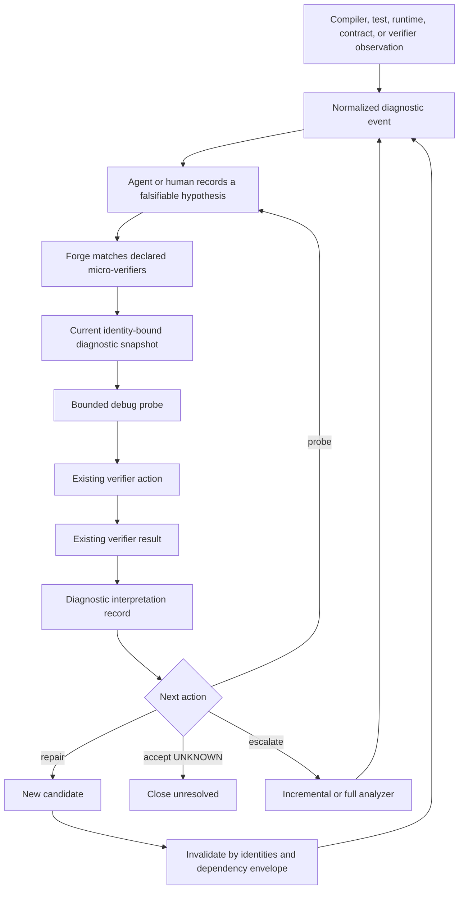

# Query-driven micro-debugging

Query-driven micro-debugging extends machine-native micro-verifiers from isolated bounded checks
into a development-time diagnostic loop. Large analyzers may still build ASTs, IR, symbol indexes,
control-flow graphs, code-property graphs, sanitizer traces, or test corpora, but the agent should
normally consume those capabilities through small, explicit questions and compact witnesses rather
than unbounded report dumps.

This document defines the architecture and record vocabulary only. It does not add a persistent
compiler daemon, result cache, automatic repair planner, new MCP tools, or new authority.

## Problem

The current verifier flow is intentionally narrow:

```text
structured uncertainty
  -> deterministic verifier match
  -> one declared Provider Protocol request
  -> one immutable verifier action/result pair
  -> repair, accept UNKNOWN, or escalate
```

That is a sound evidence boundary, but repeated debugging can still fall back to expensive compiler,
LLVM, sanitizer, Joern, or whole-test-suite output. Large output is costly for both the provider and
the agent, mixes relevant and irrelevant observations, and makes it harder to preserve a precise
claim boundary.

The desired loop is:

```text
normalized diagnostic event
  -> explicit hypothesis
  -> one bounded probe against a reusable diagnostic snapshot
  -> existing verifier action/result
  -> compact diagnostic interpretation
  -> repair, another probe, accept UNKNOWN, or deliberate escalation
```

The goal is not to eliminate compilers or broad analyzers. The goal is to make them reusable query
engines and escalation backends.

## Design principles

1. **Narrow questions precede broad scans.** A full analyzer run is a deliberate escalation level,
   not the default response to every uncertainty.
2. **Forge remains orchestration, not analysis.** Providers own AST, IR, graph, runtime, reduction,
   or language-specific algorithms.
3. **No parallel evidence system is introduced.** A debug probe links to the existing
   `verifier_action`; a debug probe result links to the existing `verifier_result`.
4. **Diagnostic interpretation is not normative conformance.** Events, hypotheses, repair scopes,
   and escalation recommendations are development context.
5. **Statuses remain separate.** Verifier `PASS | FAIL | UNKNOWN`, hypothesis disposition, snapshot
   freshness, session lifecycle, and escalation level are different dimensions.
6. **Large internal state may be reusable; output remains bounded.** A provider can build an
   expensive representation once and answer many small questions without disclosing the full
   representation.
7. **Identity precedes reuse.** Candidate, toolchain, provider, configuration, environment, input,
   contract, snapshot, and dependency identities must prevent unsafe reuse.
8. **Forge does not contain an LLM planner.** The agent or human states the hypothesis and requests a
   declared probe. Forge performs deterministic matching, authority checks, execution, recording,
   freshness evaluation, and disclosure.
9. **Development feedback cannot become evaluator feedback by relabeling.** Micro-debugging is
   initially development-only and is not reusable as final evaluation for the same epoch.
10. **Missing capability remains `UNKNOWN`.** Unsupported syntax, incomplete dependency knowledge,
    unavailable snapshots, provider failures, or inconclusive probes do not become success.

## Architecture



### Components

#### Diagnostic session

A diagnostic session binds one development epoch and candidate to the material configuration,
environment, toolchains, snapshots, events, hypotheses, and probes used during a debugging loop.

A session is a lineage and coordination record. It is not a long-lived process claim. A provider may
keep a compiler server alive, persist a content-addressed snapshot, or rebuild an ephemeral snapshot
from recorded identities. Forge records what existed and what identities governed it, not an
unsupported claim that a daemon remained trustworthy.

#### Diagnostic snapshot

A diagnostic snapshot identifies a reusable provider representation such as:

- Clang AST or semantic index;
- LLVM IR, control-flow graph, dominator tree, or use-definition index;
- symbol index;
- Joern or other code-property graph;
- sanitizer or runtime trace set;
- test discovery or reduced reproducer corpus; or
- a composite representation.

The snapshot record declares coverage, dependency-envelope completeness, storage class, provider and
toolchain identities, candidate identity, material inputs, and freshness. The internal representation
does not need to be serialized into the Forge ledger.

#### Normalized diagnostic event

A diagnostic event is a compact observation from a compiler, test, runtime, verifier, analyzer,
contract check, or human. It retains an identity for the raw bounded artifact when available, but
does not copy unbounded logs into the record.

An event has no conformance status. Severity describes the observation, not whether an MNCS claim
passed or failed.

#### Debug hypothesis

A hypothesis is an explicit, falsifiable development claim created by an agent or human. It names
the uncertainty class, target, expected observation, and falsification criteria.

Hypothesis disposition is:

- `PROPOSED`;
- `SUPPORTED`;
- `REFUTED`;
- `UNRESOLVED`; or
- `SUPERSEDED`.

A hypothesis is not evidence by itself. Its disposition must be linked to probe results or other
identified observations.

#### Debug probe

A debug probe records the narrow question, selected verifier declaration, provider method, bounded
inputs, relevant snapshots, budget, and escalation level. Once execution begins, it links to the
normal `verifier_action` identity.

The initial escalation levels are:

- `micro` — one narrow bounded question;
- `incremental` — an affected region, translation unit, module, targeted sanitizer run, or bounded
  graph slice; and
- `full-scan` — whole-project compilation, broad static analysis, full sanitizer/test suite,
  mutation campaign, or equivalent escalation.

The level is a cost and scope classification, not an evidence status.

#### Debug probe result

A debug probe result is an interpretation link over an existing `verifier_result`. It records:

- the verifier status without redefining it;
- whether the result supports, refutes, or does not resolve the hypothesis;
- a compact witness identity and bounded locations;
- a repair scope;
- the dependency envelope used for freshness;
- the recommended next action; and
- additional uncertainty classes that remain.

Cross-record validation must require the repeated verifier status to match the referenced
`verifier_result`. A mismatch is malformed diagnostic state and cannot be treated as a successful
probe.

## Record vocabulary

The following vocabulary is the proposed compatibility boundary. Runtime integration should later
publish versioned schema snapshots and migrations without changing these meanings.

| Record | Purpose | Authority |
|---|---|---|
| `diagnostic_session` | Bind one candidate debugging loop and its material identities | Development context |
| `diagnostic_snapshot` | Identify a reusable provider representation and its coverage | Development context |
| `diagnostic_event` | Normalize a bounded observation without importing an entire report | Development context |
| `debug_hypothesis` | State a falsifiable explanation for one or more events | Agent/human proposal |
| `debug_probe` | Link a bounded diagnostic question to a declared micro-verifier action | Development action |
| `debug_probe_result` | Interpret an existing verifier result for repair and escalation | Development evidence link |

These are architectural record definitions, not implemented persistent records. The typed-model
and migration work must later preserve their meanings and publish compatibility snapshots.

## Status and authority separation

The following values must never be collapsed into one field:

| Dimension | Values |
|---|---|
| Verifier claim | `PASS`, `FAIL`, `UNKNOWN` |
| Hypothesis disposition | `PROPOSED`, `SUPPORTED`, `REFUTED`, `UNRESOLVED`, `SUPERSEDED` |
| Snapshot freshness | `CURRENT`, `STALE`, `UNAVAILABLE` |
| Session lifecycle | `OPEN`, `CLOSED`, `INVALIDATED` |
| Probe lifecycle | `REQUESTED`, `STARTED`, `COMPLETED`, `ABORTED` |
| Escalation level | `micro`, `incremental`, `full-scan` |

Examples:

- a verifier may `PASS` its narrow type-compatibility claim while the broader hypothesis remains
  `UNRESOLVED`;
- a verifier may `FAIL` its claim and therefore support a hypothesis, but that does not mean the
  candidate fails MNCS;
- a snapshot may be `STALE` while the historical verifier result remains an immutable recorded fact;
- a completed full scan may still return `UNKNOWN`; and
- a supported development hypothesis is not independent evaluator evidence.

## Identity and invalidation

A diagnostic snapshot is current only for the material identities it binds. At minimum, reuse must
consider:

- mode;
- source epoch and candidate;
- project configuration and policy;
- provider declaration and configured executable;
- provider-reported identity where available;
- toolchain and compilation database;
- material environment;
- contract and reference inputs when used;
- source and generated input identities;
- snapshot construction method and version; and
- provider-declared dependency envelope.

A candidate change invalidates a snapshot by default. It may remain current only when the provider
declares a complete dependency envelope and every material dependency identity remains unchanged.
Missing or incomplete impact information produces `UNKNOWN`, not optimistic reuse.

The same rule applies to a future probe-result cache. The schema being ready for reuse does not mean
reuse is currently enabled.

## Provider interaction

Micro-debugging should remain provider-neutral. A future Provider Protocol extension may support
capabilities equivalent to:

```text
diagnostic_snapshot_build
diagnostic_snapshot_inspect
diagnostic_probe
diagnostic_snapshot_close
```

Those names are illustrative, not an accepted protocol change.

A provider may implement the capabilities with Clang, LLVM, rustc, language servers, Joern,
sanitizers, debuggers, fuzzers, test reducers, symbolic execution, or purpose-built analyzers.
Declarations must expose narrow methods such as:

```text
c-type-conversion-path
c-pointer-ownership-path
llvm-dominating-definition
llvm-bounded-use-def
abi-symbol-drift
contract-symbol-binding
minimal-failing-input
evidence-dependency-impact
```

The stable abstraction is the declared question and bounded claim, not the analyzer brand.

## Agent-facing behavior

The eventual agent workflow should make the following pattern cheap:

1. ingest or select one normalized event;
2. state one hypothesis with falsification criteria;
3. ask Forge for compatible declared probes;
4. run one low-cost probe;
5. inspect the compact witness and remaining uncertainty;
6. repair only the identified scope;
7. register a new candidate and invalidate affected snapshots/results;
8. rerun only current or affected probes; and
9. escalate only when narrow probes are unavailable, contradictory, inconclusive, or more expensive
   than the broader analysis.

Forge may recommend deterministic next operations from declared metadata and result fields. It must
not invent an undeclared executable, silently launch every compatible verifier, or treat a
recommendation as evidence.

## Initial MNCS-oriented probe families

The first useful families should target agent blind spots that ordinary compiler output does not
resolve well:

- contract-to-symbol binding;
- invariant preservation across a candidate change;
- generated/reference binding drift;
- assumption consumption and unresolved assumption propagation;
- proof-obligation coverage;
- explicit `UNKNOWN` propagation;
- evidence dependency invalidation;
- candidate and epoch lineage mismatch;
- cross-module claim consistency;
- witness minimization;
- accidental loss of observability;
- semantic duplication between mechanisms claimed as independent;
- repair that resolves one claim while invalidating another; and
- complexity added without identified useful-benefit evidence.

Language-specific probes can then add type, lifetime, control-flow, ABI, memory, concurrency, and
runtime questions.

## Security and disclosure

Micro-debugging increases the amount of repair-capable development context. Therefore:

- diagnostic sessions are development-only in the first implementation;
- protected evaluator data cannot be imported into a development snapshot;
- raw logs, source regions, witnesses, paths, and values remain bounded by policy;
- provider state is untrusted unless a runner establishes stronger execution properties;
- snapshot persistence must use content identities and safe path handling;
- callers cannot choose arbitrary executables, argv, environment, or working directories;
- closing a session does not make its results independent, externally anchored, or protected; and
- evaluator-mode use requires a separate design that preserves status-only disclosure and prevents
  repair feedback for the same epoch.

Forge Cell and micro-debugging solve different problems. Forge Cell can strengthen the execution
boundary for a diagnostic provider; it does not make the provider's method correct. Micro-debugging
can improve localization and repair; it does not make local execution independent.

## Non-goals of this specification foundation

This foundation does not:

- implement a compiler or analyzer daemon;
- keep provider processes alive;
- add result caching or automatic reuse;
- infer semantic dependencies;
- add automatic code repair;
- add hidden chain-of-thought records;
- change Provider Protocol 0.1;
- add CLI or MCP operations;
- change existing verifier action/result semantics;
- make large scans obsolete;
- establish MNCS or MNCDS conformance;
- create independent evaluation or protected custody; or
- guarantee that a debugging hypothesis is correct.

## Implementation order

The ordered implementation handoff is maintained in
[`docs/codex-micro-debugging-next-steps.md`](codex-micro-debugging-next-steps.md). The architecture
depends on the central typed-record, transaction, modular-service, operation-registry, and runner
tasks. It should be integrated after those boundaries exist rather than patched into the current
monolithic verifier service.
