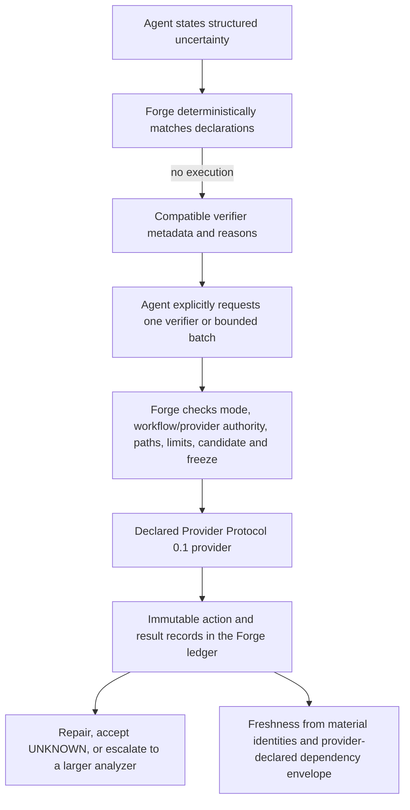

# Machine-native micro-verifiers

Machine-native micro-verifiers are small, capability-declared verification providers that answer
narrow questions arising during machine-led development. Forge selects and invokes them through
bounded requests, preserves their witnesses, assumptions, identities, and limitations, and
connects their results to candidate lineage and evidence freshness. Development results may guide
repair; evaluator results remain subject to freeze, separation, custody, and disclosure rules.

A micro-verifier is not a monolithic analyzer, whole-program proof, MNCS or MNCDS validator,
certification system, source of independent evaluation, or custody mechanism. A `PASS` applies
only to the verifier's declared claim, method, bounded inputs, assumptions, environment, and
dependency envelope. Compilers, test harnesses, sanitizers, mutation tools, benchmarks, Joern,
and other analyzers remain replaceable Provider Protocol backends or escalation paths.

## Control flow

Forge does not infer an executable or accept caller-supplied argv. Every verifier references a
declared Provider Protocol workflow and provider capability. The workflow supplies the command,
mode boundary, category, environment, workspace, and disclosure ceiling. The verifier can only
narrow those authorities.

## Declaration

The minimal example declares two verifiers in
[`examples/minimal/mncs-forge.toml`](../examples/minimal/mncs-forge.toml):

- `evidence.change-impact` compares explicit changed paths with a caller-declared bounded
  dependency envelope. Its `PASS` does not prove semantic independence.
- `python.bounded-add-equivalence` safely interprets one supported Python expression shape and
  compares candidate and reference outputs for integer pairs in `[-2, 2]`. Unsupported syntax is
  `UNKNOWN`.

Each `[[verifiers]]` table declares an ID and version, referenced workflow/provider, Provider
Protocol method, narrow claim, existing workflow category, modes, languages or artifact types,
scopes, accepted input kinds, cost, timeout, assumptions, limitations, uncertainty classes,
optional tags, allowed question-parameter keys, and optional stricter disclosure.

Provider `capabilities` are the authoritative declared method names. Configuration loading rejects
duplicate verifier IDs, missing providers/workflows, methods absent from provider capabilities,
non-Provider-Protocol workflows, category or command mismatches, mode expansion, development runs
without provider authority, timeout expansion, and disclosure expansion. A verifier table has no
command or environment field.

Projects with no `[[verifiers]]` remain valid and return an empty capability list.

## Discovery and deterministic matching

`verifier list` and `verifier describe` return compact metadata and never probe or execute a
provider. They omit commands, environment values, executable identities, and protected data.

Matching accepts explicit uncertainty classes plus optional language, artifact type, changed
paths, scope, required category, active mode, and maximum cost. Forge filters declarations and
sorts compatible results by:

1. configured cost (`low`, `medium`, `high`);
2. descending number of matching uncertainty classes; and
3. verifier ID.

Every candidate contains inclusion and exclusion reasons. Matching never executes a verifier.
No match returns `NO_MATCH` with unresolved status `UNKNOWN`; Forge does not guess or invoke an
LLM.

## Bounded execution

A run names a declared verifier ID and may supply only its declared bounded input kinds:

- candidate identity;
- candidate/generated changed paths;
- one bounded source region;
- current contract identity;
- dependency-slice identities;
- prior artifact identity; and
- JSON question parameters whose keys are allowlisted by the verifier declaration.

Executable, argv, shell, environment, and working-directory parameters are forbidden. Requests
are capped by bytes, path count, identity count, parameter count/depth, source-region length,
timeout, output, stderr, witness, and result size. Batches are explicit, unique, sequential,
bounded by count and total declared duration, and retain every individual result. The optional
batch summary uses `FAIL > UNKNOWN > PASS`; it never turns several narrow results into a
whole-program claim.

Forge sends one Provider Protocol 0.1 JSON Lines `analysis_request`, with `analysis` equal to the
declared method, in the same reduced temporary workspace used by provider workflows. It accepts
exactly one matching `analysis_response`. Timeout, process failure, malformed/multiple/empty
stdout, wrong response type, request-ID mismatch, output overflow, or provider identity drift
produces a recorded operational `UNKNOWN`, never `PASS` or analysis `FAIL`. Exit zero alone is
not evidence.

Unsupported languages, constructs, environments, or methods use `UNKNOWN` plus explicit
`unsupported_constructs` and limitations. There is no fourth conformance status.

## Records, identity, and freshness

Every invocation appends a `verifier_action` and `verifier_result` to the existing hash-linked
ledger and writes corresponding immutable records under `.mncs-forge/records/`. Records bind:

- verifier ID/version and full declaration identity;
- configured and reported provider identities;
- method, mode, epoch, candidate, and frozen identity;
- exact bounded input identities;
- configuration, policy, and material environment identities;
- status, summary, compact witness, assumptions, limitations, and unsupported constructs;
- duration, bounded stderr, operational error, timestamps, request identity, provider response
  identity, and output identity; and
- a provider-declared dependency envelope and its path identities.

No result cache is enabled in this first implementation. The record keys are intentionally ready
for a future cache, but reuse must bind every material identity above. A mode, candidate/input,
dependency, verifier, provider, configuration, policy, or environment change must prevent unsafe
reuse.

`verifier explain` recalculates material identities and dependency-envelope identities:

- a changed material identity or dependency path makes the result `STALE`;
- an unchanged candidate makes it `CURRENT`;
- a changed candidate can remain `CURRENT` only when every dependency identity is unchanged and
  the provider declared the envelope complete; and
- missing or incomplete impact information remains `UNKNOWN`.

The freshness state is lineage metadata, not a fourth verification status. A provider-declared
complete path envelope is still an assumption about semantic dependencies; path separation alone
does not prove independence.

## Development and evaluator separation

Development results are labeled `development_evidence`, can disclose compact repair witnesses,
and remain operator-controlled local evidence. They cannot establish independence.

Evaluator runs require the existing selected/frozen candidate, frozen authority identities, and
pre/post drift checks. Status-only declarations remove witnesses, assumptions, unsupported
details, dependency paths, stderr, and repair-enabling summaries from both the result record and
caller response. Every evaluator result is labeled `local_evaluator_evidence` with
`independent_evaluation: false`. Reusing a verifier during development and evaluation does not
turn iterative repair evidence into independent evaluation.

Final evaluator results are not repair feedback for the same development epoch. Protected data is
never selectable as a caller-supplied changed path, and development workspaces never include the
configured protected partition.

## Initial limitations and extension path

This first slice does not implement result caching, parallel batches, per-verifier JSON Schema for
question-parameter values, semantic dependency inference, a network sandbox, or broad language
analysis. Provider dependency envelopes are trusted bounded claims that remain subject to their
stated limitations. Configured executables retain ambient host permissions; use OS/container
isolation for adversarial providers.

New verifier families should add a narrowly named Provider Protocol method, advertise it in a
provider capability declaration, add a verifier declaration that references an authorized
workflow, and return compact witnesses and explicit `UNKNOWN` limitations. Forge itself should
not absorb analyzer-specific algorithms. Joern can back reachability/data-flow verifiers or serve
as an escalation path, but the stable abstraction is the bounded claim, not the analyzer brand.
